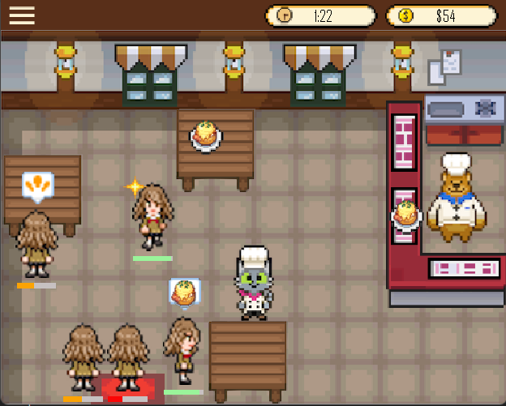

<p align="center">
  
  
</p>

## 🍽️🧑‍🍳 Cat and Bear Cafe 😺🐻
A time-management cafe game where you, the cat waiter, must keep customers happy and fed! 

### How to play:
- Use your mouse to serve customers quickly and efficiently.
- Seat them, take their orders, and deliver food while managing their happiness bar.
- Keep an eye on their happiness—if it hits zero, they’ll storm off! 😡
- Earn money based on how happy your customers are when they finish their meal! 💸

**💥 Challenge:**
The clock is ticking, and the difficulty ramps up as more customers flood your cafe. How many happy customers can you serve before time runs out? ⏰

### How to run:
Make sure you have Maven and Java installed. Clone the repository:
 ```
 $ git clone https://github.com/JeslynLu/Cat-and-Bear-Cafe.git
``` 
Navigate to the project directory:
``` 
$ cd Cat-and-Bear-Cafe
```
Build the project with Maven:
``` 
$ mvn clean package
``` 
Run it and enjoy!
``` 
$ java -cp target/cat-and-bear-cafe-1.0-SNAPSHOT.jar dev.jeslynlu.catandbearcafe.CafeGame
``` 
### Gameplay Example:
[](https://www.youtube.com/shorts/EQ1OAXI9--8)
